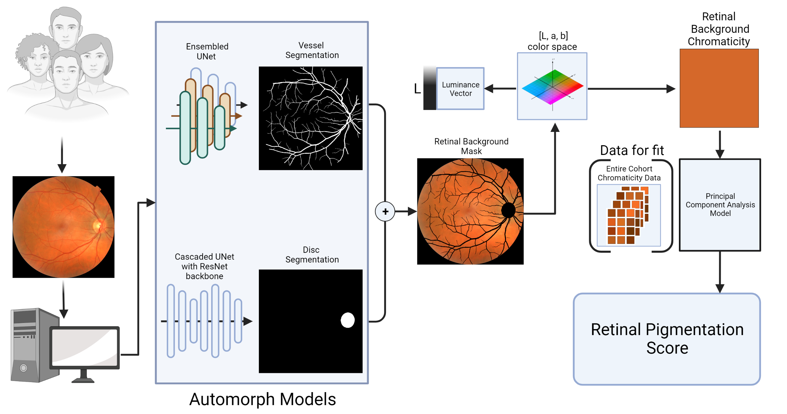

# Retinal Pigmentation Score (RPS)

This repository contains code that calculates the retinal pigmentation from a color fundus image using deep learning to segment the vasculature and nerve, then finds the median pixel value of retinal background in the Lab colorspace.

Preprint is here: https://www.medrxiv.org/content/10.1101/2023.06.28.23291873v1



## Requirements

Requirements are listed in requirements.txt file if you want to install your own environment, otherwise you can install a docker file via instructions below

## Runtime

For around 70000 images with an 8GB GPU and 128GB RAM computer, it takes around 6hrs to run the code.

You may change the batch size to improve the inference speed at src/config.py. Here are some rough estimates with batch size and the amount of GPU memory used.

    M1_quality: batch size of 20 used about 5GB

    M2_vessel: batch size of 7 used about 8GB
  
    M2_disc: batch size of 20 used about 3.4GB

## Example dataset -APTOS2019

An fully executed example of 10 randomly selected images without diabetic retinopathy from the APTOS2019 dataset are included for view

The images are in test/test_images/

The results are in test/test_results/

It took around 30 seconds to run the code with an 8GB GPU and 128GB RAM computer

## Dataset Format

### Input
  
All color fundus photos need to be in a single directory and in png format. 

OR

You can specify the path to a csv file in the config.py file under the 'csv_path' variable. The absolute paths of the filenames muse be listed under a column in the csv called 'path'

### Output
    
All results will be dumped into a folder that you specify, for example: `/data/arajesh/rps/results`.

The results directory will have the following structure:

```
.
├── M0/ Pre-processing outputs
├── M1/ Image Quality Assessment
|   ├── Good_quality/image_list.csv **(list of good quality images)**
├── M2/
|   ├── binary_vessel/raw_binary/ **(binary vessel segmentation masks)**
|   |   ├── vessel_seg1.png
|   |   └── vessel_seg2.png
|   ├── disc_cup/optic_disc_cup/ **(disc segmentation masks)**
|   |   ├── disc_seg1.png
|   |   └── disc_seg2.png
├── retinal_pigmentation_score.csv **(csv with median a,b values and 'pigmentation' a.k.a RPS score)**
└── RPS_representative_images.png **(representative figure giving context for what RPS scores are with regards to RGB colors)**
```

## Setup Instructions


1. Clone this code repository:

```
git clone https://github.com/arajesh17/retinal-pigmentation-score.git
```

### Option 1 (using docker)

2a. Pull the docker container and start it.

The docker container is stored [here](https://hub.docker.com/r/arajesh17/rps).

Please pull the repo:

```
docker pull arajesh17/rps
```

Now, in your terminal after you finished the pull, you can start the container with an interactive shell:

```
docker run -it -v <your images path:/home/images/> -v <your results path>:/home/results/ -v <your rps repo path>:/home/retinal-pigmentation-score/ --gpus all arajesh17/rps /bin/bash
```

3a. Activate the python environment in the docker container:

```
conda activate automorph
```
    
### Option 2 (create your own environment)

2b. Type the command:

```
conda create --name rps python=3.8
```

Followed by:

```
conda activate rps
```

3b. Install requirements:

```
pip install -r requirements.txt
```


Execution Instructions
Edit results_dir and image_dir in src/config.py to reflect the output directory you want your files to go and the directory where your images should be stored.

In your environment, run main.py:

```
python /home/retinal-pigementation-score/src/main.py
```

Figure out the optimal worker number and batch_size:

Run main.py() and also nvidia-smi in another window on the same machine to look at GPU memory usage while executing the code. If you are not using all of your card's memory, increase the batch size until you are using nearly all of it. Batch size can be modified in the src/config.py file of this repository.

### Option 3 (Use Google Colab)

Use the free T4 provided in our [Google Colab Notebook](https://colab.research.google.com/drive/1gPBjG0jTHnennObZ2JnDC42A5po7Qlen?usp=sharing)

## Credit
A significant portion of this pipeline was built from code from Automorph. Thank you!

[Automorph Github Repository](https://github.com/rmaphoh/AutoMorph/blob/main/README.md)

```
@article{zhou2022automorph,
  title={AutoMorph: Automated Retinal Vascular Morphology Quantification Via a Deep Learning Pipeline},
  author={Zhou, Yukun and Wagner, Siegfried K and Chia, Mark A and Zhao, An and Xu, Moucheng and Struyven, Robbert and Alexander, Daniel C and Keane, Pearse A and others},
  journal={Translational vision science \& technology},
  volume={11},
  number={7},
  pages={12--12},
  year={2022},
  publisher={The Association for Research in Vision and Ophthalmology}
}
```
